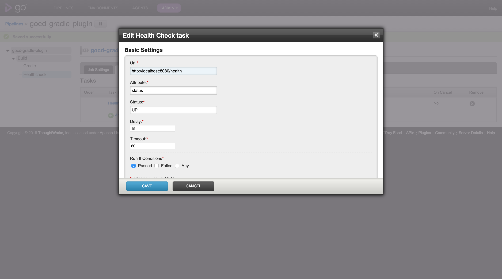

# Go Continuous Delivery Health Check plugin

> Go Continuous Delivery task for awaiting until your application is healthy

## Installation

Download the plugin and copy it into `$GO_SERVER_HOME/plugins/external` and restart the Go server.

The plugin should appear on Plugins page.

## Usage

Add Health Check task to your build stage. The task with delay the execution of your pipeline according 
to the configured setting in the same time performing fixed delay HTTP request to the provided health url.

The application health information is expected to be returned in a form of JSON with configurable expected status.

## Options

### Url

The url to the application health information. (required)

Example: http://localhost:8080/health

### Attribute

The name of attribute indicating the application status. (required)

Example: status

### Expected status

The expected application health status. (required)

Example: UP

### Delay

Time in seconds after a retry check will be performed after unsuccessful request. (required)

Example: 15

### Timeout

Maximum number of seconds to wait for the application to become healthy. (required)

Example: 60

## License

Apache 2.0